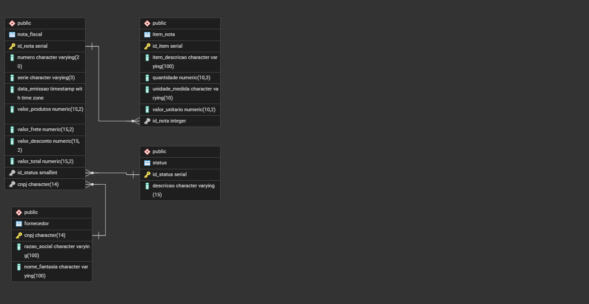

# TaxAnalytics

Sistema para importação, processamento e gerenciamento de Notas Fiscais Eletrônicas (NF-e) utilizando **Python**, **FastAPI** e **PostgreSQL**.

O objetivo do projeto é automatizar o recebimento de notas fiscais em XML, organizar seus dados em banco de dados e disponibilizar essas informações através de uma API REST para consultas e futuras análises.

---

## Tecnologias utilizadas

- Python 3.13
- FastAPI
- Pydantic
- PostgreSQL
- Psycopg2
- Uvicorn

---

## Estrutura do projeto

```
TaxAnalytics/
│
├── docs/                  # DER e documentação
├── xmls/                  # Arquivos XML utilizados nos testes
│
├── database.py            # Conexão com o PostgreSQL
├── fornecedor.py          # CRUD de fornecedores
├── models.py              # Modelos Pydantic
├── main.py                # Rotas da API
├── importador_xml.py      # Importação das NF-e (em desenvolvimento)
├── nota_fiscal.py         # Regras de negócio das notas
├── item_nota.py           # Regras dos itens das notas
│
├── requirements.txt
├── .env.example
└── TaxAnaliticsDB.sql
```

---

## Funcionalidades implementadas

### API

- Cadastro de fornecedores
- Listagem de fornecedores
- Busca de fornecedor por CNPJ

### Banco de Dados

- Modelagem relacional
- Integridade referencial
- Constraints de validação
- Tratamento de chaves estrangeiras

### Segurança

- Credenciais protegidas por arquivo `.env`
- Tratamento de exceções
- Validação automática de dados utilizando Pydantic

---

## Próximas funcionalidades

- Importação automática de XML das NF-e
- Cadastro automático de fornecedores
- Cadastro automático das notas fiscais
- Cadastro dos itens das notas
- Atualização de status das notas
- Relatórios analíticos
- Dashboard em Power BI

---

## Como executar

Clone o repositório

```bash
git clone https://github.com/seu_usuario/TaxAnalytics.git
```

Entre na pasta

```bash
cd TaxAnalytics
```

Crie um ambiente virtual

```bash
python -m venv .venv
```

Ative o ambiente

Windows

```bash
.venv\Scripts\activate
```

Instale as dependências

```bash
pip install -r requirements.txt
```

Configure o arquivo `.env`

```env
DB_HOST=localhost
DB_PORT=5432
DB_NAME=automacao_nfs
DB_USER=seu_usuario
DB_PASSWORD=sua_senha
```

Execute a aplicação

```bash
uvicorn main:app --reload
```

A documentação estará disponível em

```
http://127.0.0.1:8000/docs
```

---

## Modelo de Dados



## Status do projeto

🚧 Em desenvolvimento

Atualmente o foco está na implementação do módulo de importação de arquivos XML e na automação do cadastro das notas fiscais.

---

## Autor

Isaac Matheus dos Santos Novais

LinkedIn:
https://www.linkedin.com/in/isaac-matheus-novais/

GitHub:
https://github.com/IsaacMatheusNovais

