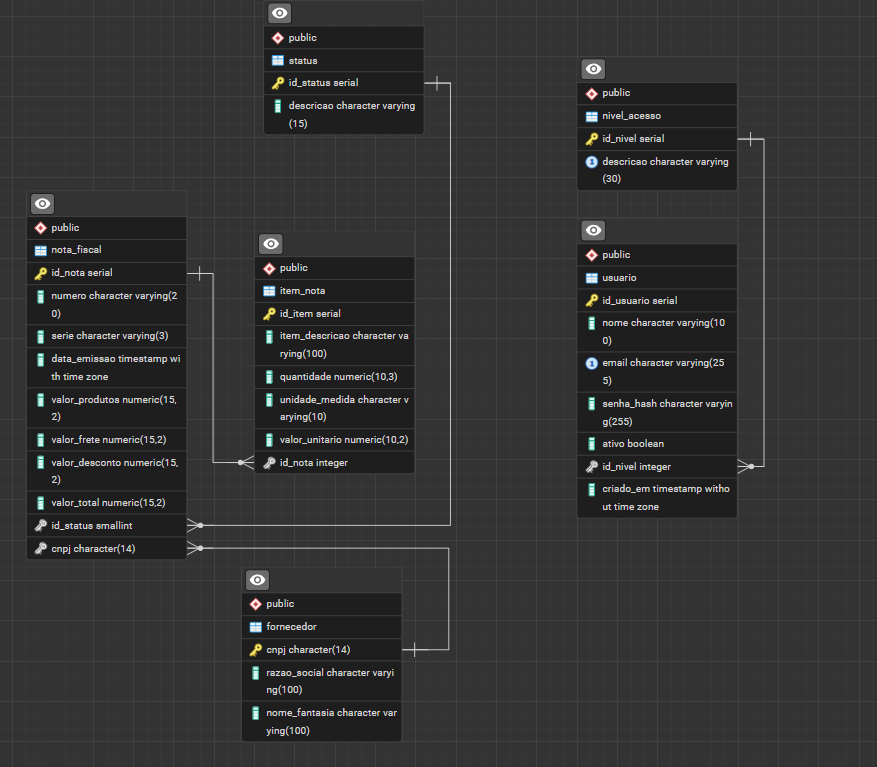

# TaxAnalytics

Sistema backend desenvolvido para automatizar a importação e o processamento de Notas Fiscais Eletrônicas (NF-e), armazenando os dados em um banco PostgreSQL e disponibilizando uma API REST construída com FastAPI.

O projeto tem como objetivo simular um sistema utilizado em empresas para automatizar processos fiscais, reduzir trabalho manual e servir como projeto de portfólio para desenvolvimento Backend.

---

## Funcionalidades

### Importação de XML

- Importação de uma ou múltiplas NF-es.
- Leitura automática do XML.
- Cadastro automático de fornecedores.
- Cadastro da nota fiscal.
- Cadastro dos itens da nota.
- Processamento individual de cada arquivo.
- Relatório de sucesso e erro para cada XML enviado.

### Gerenciamento de Usuários

- Cadastro de usuários.
- Consulta de usuários por e-mail.
- Senhas armazenadas utilizando hash com BCrypt.

### Autenticação

- Login utilizando OAuth2 Password Flow.
- Geração de JWT (JSON Web Token).
- Rotas protegidas por autenticação.
- Controle de acesso baseado em níveis de usuário.

---

## Tecnologias Utilizadas

- Python
- FastAPI
- PostgreSQL
- Psycopg2
- Pydantic
- BCrypt
- JWT (python-jose)
- Uvicorn

---

## Estrutura do Projeto

```text
TaxAnalytics
│
├── autenticacao.py
├── database.py
├── fornecedor.py
├── importador_xml.py
├── main.py
├── models.py
├── usuario.py
├── xmls/
└── docs/
```


---

## Fluxo de Autenticação

```text
Cliente
      │
      ▼
POST /login
      │
      ▼
JWT
      │
      ▼
Authorization: Bearer <token>
      │
      ▼
Rotas Protegidas
```

---

## Funcionalidades Implementadas

- [x] Importação de XML
- [x] Cadastro automático de fornecedores
- [x] Cadastro de notas fiscais
- [x] Cadastro de itens da nota
- [x] Cadastro de usuários
- [x] Hash de senhas (BCrypt)
- [x] Login
- [x] JWT
- [x] Autenticação de rotas
- [x] Controle de acesso por nível

---

## Próximas Etapas

- [ ] CRUD completo de usuários
- [ ] Testes automatizados
- [ ] Docker
- [ ] Dashboard
- [ ] Relatórios
- [ ] Logs de auditoria